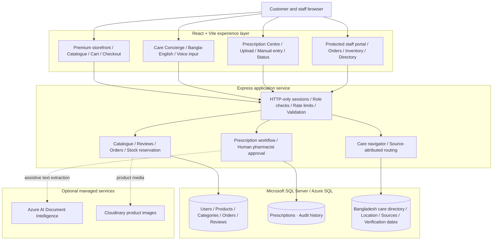

# Aurevia Care

> A safety-first digital pharmacy and local-care discovery platform for Bangladesh.

[](client)
[](server)
[](server/migrations)
[](#licensing)

Aurevia Care pairs a premium pharmacy storefront with prescription-aware fulfilment and a source-attributed Bangladesh care navigator. It is built for a pharmacist-led operating model: the application can help people discover products and care services, but it never diagnoses, prescribes, or substitutes professional medical judgement.

## Project links

| Resource | Availability |
| --- | --- |
| Source repository | [github.com/shadianoormou/aurevia-care](https://github.com/shadianoormou/aurevia-care) |
| Local preview | [http://127.0.0.1:5173](http://127.0.0.1:5173) — available on the development machine |
| Continuous delivery | [GitHub Actions](https://github.com/shadianoormou/aurevia-care/actions) — validates every push to `main` |
| Public production site | **Pending Azure App Service and Azure SQL provisioning** — a public URL is intentionally not claimed before the full secure service is deployed |

> The local preview is not an internet-facing public website. The production deployment pipeline is already in the repository and will publish the same application once the Azure production environment is connected.

## Why it exists

Healthcare shopping needs more than a pretty catalogue. Aurevia Care gives customers a refined way to browse care essentials, securely submit prescriptions, and find appropriate local services; it gives pharmacy teams the operational controls needed to review prescriptions, manage inventory, publish trusted directory entries, and protect fulfilment history.

## Highlights

- **Luxury, responsive storefront** — editorial hero layouts, animated category browsing, product imagery, shareable filters, and polished mobile-first interactions.
- **Five care collections** — Medicines & Wellness, Skin Care, Hair & Scalp, Oral & Dental, and Creams & First Aid, with 21 SQL-backed subcategories.
- **Prescription centre** — authenticated image/PDF upload or manual entry, protected file access, pharmacist review states, approval expiry, and order gating.
- **Professional authentication** — email/password or Bangladesh phone/password registration, email-or-phone sign-in, Google Identity Services support, secure HTTP-only sessions, identity uniqueness indexes, and rate-limited auth endpoints.
- **Voice-assisted discovery** — browser-supported Web Speech input for product and symptom search, with keyboard-friendly manual search as the dependable fallback.
- **Bangladesh Care Concierge** — Bangla/English text and voice questions with safety-first care routing across all 8 divisions and 64 districts, plus a curated directory for hospitals, doctors, diagnostics, blood support, and emergency contacts.
- **Trustworthy directory workflow** — public entries must carry a source URL and verification date; admins can publish, update, or archive them without silently deleting history.
- **Fulfilment controls** — role-based workspaces, transaction-safe stock reservation, cancellation rollback, immutable order snapshots, and inventory administration.
- **SQL-first foundation** — GUIDs, foreign keys, check constraints, indexes, parameterised queries, migration scripts, location taxonomy, and audit timestamps in Microsoft SQL Server / Azure SQL.

## Product boundaries

This repository intentionally keeps health and pharmacy operations within safe boundaries.

- The Care Concierge is **care navigation**, not a diagnostic model, emergency service, or medication-dosing engine.
- Prescription-only products require pharmacist approval before checkout. OCR, when enabled, only extracts text; it does not approve a prescription.
- Blood availability, chamber schedules, and provider contact details must be confirmed with the provider. The directory records the published source and last verification date.
- A public medicine registry is not a sellable catalogue. Before a product is listed for sale, the operator needs licensed-supplier authority, accurate price and stock, packaging-image rights, prescription classification, and pharmacist review.

## Technology

| Area | Implementation |
| --- | --- |
| Customer web app | React 18, React Router, Vite, Tailwind CSS |
| API | Node.js, Express 5, Helmet, express-rate-limit, JWT-backed HTTP-only cookies |
| Database | Microsoft SQL Server / Azure SQL through `mssql` and `msnodesqlv8` for LocalDB |
| Files | Prescription documents in SQL Server with role and ownership checks; optional Cloudinary product images |
| Document extraction | Optional Azure AI Document Intelligence `prebuilt-read` model |
| Care navigator | Safety-first routing rules plus source-attributed local directory data in SQL Server |
| Authentication | Email/phone password accounts plus optional Google Identity Services verification |

## Architecture



| Layer | Responsibility | Safety control |
| --- | --- | --- |
| React experience | Customer journey and protected staff workspaces | No clinical decision is made in the browser |
| Express service | API contracts, authentication, workflow enforcement, and business rules | HTTP-only cookies, role checks, allowlisted filters, rate limits |
| SQL data layer | Transactional catalogue, fulfilment, prescription, and directory records | GUIDs, foreign keys, constraints, indexes, and audit timestamps |
| Pharmacist review | Prescription approval and prescription-only ordering | OCR is assistive only; human approval is mandatory |
| Provider verification | Local care and blood-support directory publishing | Source URL, verification date, and publish/archive workflow |

### Production request path

GitHub Actions builds the React client and places it beside the Express application for a single-origin Azure App Service release. In production, the browser receives the application and calls `/api` from the same HTTPS domain; Express applies security controls and uses Azure SQL for persistent data. This avoids exposing an API key or a database connection to the browser and keeps the authenticated session cookie first-party.

## Repository layout

```text
client/                   React web application
  src/pages/              Customer, care, checkout, and administration views
  src/components/         Reusable interface components
server/                   Express API
  migrations/             Idempotent SQL Server schema migrations
  controllers/            Domain and workflow logic
  routes/                 HTTP route definitions
  seed/                   Development catalogue and care-directory bootstrap
  scripts/migrate.js      Migration runner
```

## Run locally

### Prerequisites

- Node.js 20 or later
- Microsoft SQL Server 2022+, SQL Server LocalDB, or Azure SQL
- A SQL login permitted to create and use the Aurevia Care database

### 1. Configure the API

Create a database named `aurevia_care`. Then copy `server/.env.example` to `server/.env` and set the database connection values plus a unique, 32-character-or-longer `JWT_SECRET`.

```powershell
cd server
npm install
npm run db:migrate
```

For a local starter catalogue and the initial seeded care-directory entries, add a real `ADMIN_EMAIL` and a 12-character-or-longer `ADMIN_PASSWORD` to `server/.env`, then run:

```powershell
npm run seed
```

The seed command is deliberately blocked in production unless `ALLOW_PRODUCTION_SEED=true` has been explicitly configured. The starter directory currently contains only source-attributed seed records; the Bangladesh location taxonomy is ready for verified provider imports without inventing coverage.

### 2. Configure and start the web app

Copy `client/.env.example` to `client/.env`. The development default is sufficient when the API is running locally because Vite forwards `/api` to port 5000.

```powershell
cd ../client
npm install
npm run dev
```

Start the API separately:

```powershell
cd ../server
npm run dev
```

Open `http://127.0.0.1:5173`.

## Quality checks

```powershell
# Web production build
cd client
npm run build

# Runtime dependency audit
cd ../server
npm audit --omit=dev
```

### Authentication configuration

Phone registration is available with a password and normalises Bangladesh numbers to `+8801XXXXXXXXX`. Google sign-in uses one OAuth Web Client ID in both the Vite client and Express API:

```env
# client/.env
VITE_GOOGLE_CLIENT_ID=your_web_client_id.apps.googleusercontent.com

# server/.env
GOOGLE_CLIENT_ID=your_web_client_id.apps.googleusercontent.com
```

Add both local origins (`http://127.0.0.1:5173` and `http://localhost:5173`) plus the production HTTPS origin to the Google OAuth authorised JavaScript origins. Set the same two environment variables in the hosting platform; the local values are intentionally ignored by Git. Never commit OAuth secrets, JWT secrets, SQL credentials, or administrator passwords. The bootstrap administrator requires a unique password of at least 12 characters; weak passwords such as `0000` are rejected by design.

## Production deployment

The included GitHub Actions pipeline packages the React client with the Express API and deploys both to one Azure App Service. This same-origin setup keeps `/api` calls and HTTP-only login cookies on one HTTPS domain. Use Azure SQL or a managed SQL Server instance for data.

Configure production secrets with the host’s secret manager—never commit them. At a minimum, configure:

```env
NODE_ENV=production
DB_SERVER=your-server.database.windows.net
DB_PORT=1433
DB_NAME=aurevia_care
DB_USER=your_sql_login
DB_PASSWORD=your_strong_password
DB_ENCRYPT=true
DB_TRUST_SERVER_CERTIFICATE=false
JWT_SECRET=a_unique_secret_with_at_least_32_characters
CLIENT_URL=https://your-app.azurewebsites.net
COOKIE_SAME_SITE=lax
```

Run `npm run db:migrate` against the target database before the API starts. The Azure App Service must run Node.js 20+ and have `SCM_DO_BUILD_DURING_DEPLOYMENT=true` configured so it restores the API runtime dependencies. A PCI-compliant payment provider must be integrated server-side before collecting card details.

### GitHub automatic deployment

Every push to `main` runs [`.github/workflows/azure-production.yml`](.github/workflows/azure-production.yml). It validates the API, builds the React application with the same-origin `/api` base URL, bundles it into `server/public`, and deploys the release to Azure App Service when the following GitHub **production environment** secrets and variable are present:

| GitHub configuration | Purpose |
| --- | --- |
| `AZURE_CLIENT_ID` secret | Azure workload-identity application ID |
| `AZURE_TENANT_ID` secret | Microsoft Entra tenant ID |
| `AZURE_SUBSCRIPTION_ID` secret | Azure subscription ID |
| `AZURE_WEBAPP_NAME` variable | Name of the pre-created Azure App Service app |

The workflow uses GitHub-to-Azure OpenID Connect, so no long-lived publish-profile or Azure password is stored in the repository. Create a federated credential in Azure that trusts this repository’s `main` branch and grants that identity access to the App Service. Until these values are configured, the build remains green and deployment is intentionally skipped rather than pretending a release succeeded.

## Care-directory operations

The initial Rajshahi entries point only to institutional sources such as RMCH, Ibn Sina Trust, Bangladesh Red Crescent Blood Center, Christian Mission Hospital Rajshahi, and the DGHS facility registry. The operating team should verify schedules, contacts, and blood-support availability directly with providers before publishing or refreshing each record.

Public endpoints are intentionally narrow:

```text
GET  /api/care-navigator/directory?kind=doctor&q=orthopedics
POST /api/care-navigator/ask  { "message": "হাড়ে ব্যথা হলে কোন ডাক্তার?" }
```

## Security and privacy

- Cookies are HTTP-only and authenticated routes use role checks.
- Authentication and care-navigator endpoints are rate limited, and Express security headers are enabled.
- SQL inputs use parameterised queries; product sort and filter values are allowlisted.
- Product deletion archives records. User deletion deactivates an account so clinical and fulfilment history is retained.
- Prescription files are restricted to the owner and authorised pharmacy staff.
- Never commit `.env` files, connection strings, JWT secrets, cloud-storage credentials, or Azure AI credentials.

## Licensing

This is a private client project. The code, design, content, and operational data may not be reused, redistributed, or deployed without the project owner’s written permission.

---

Built as a professional foundation for a pharmacist-led digital care business in Bangladesh.
